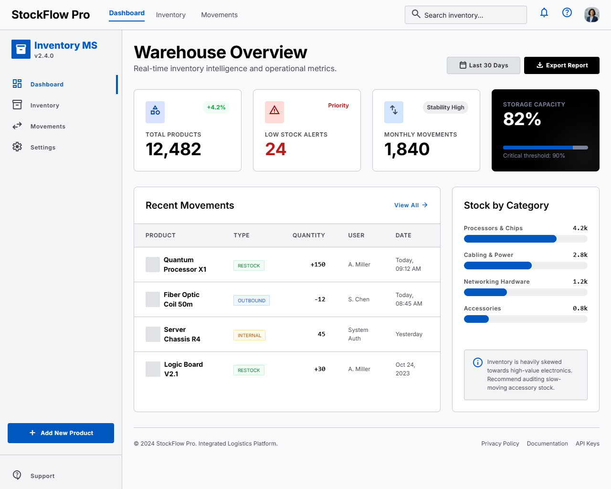
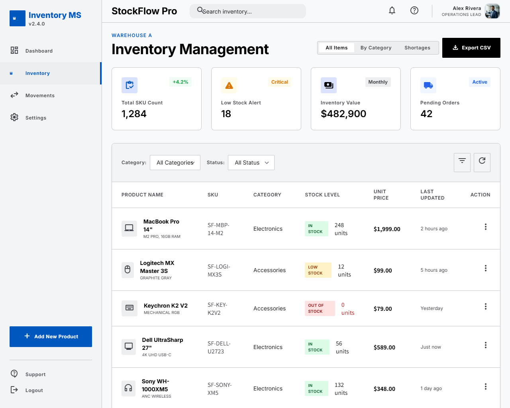
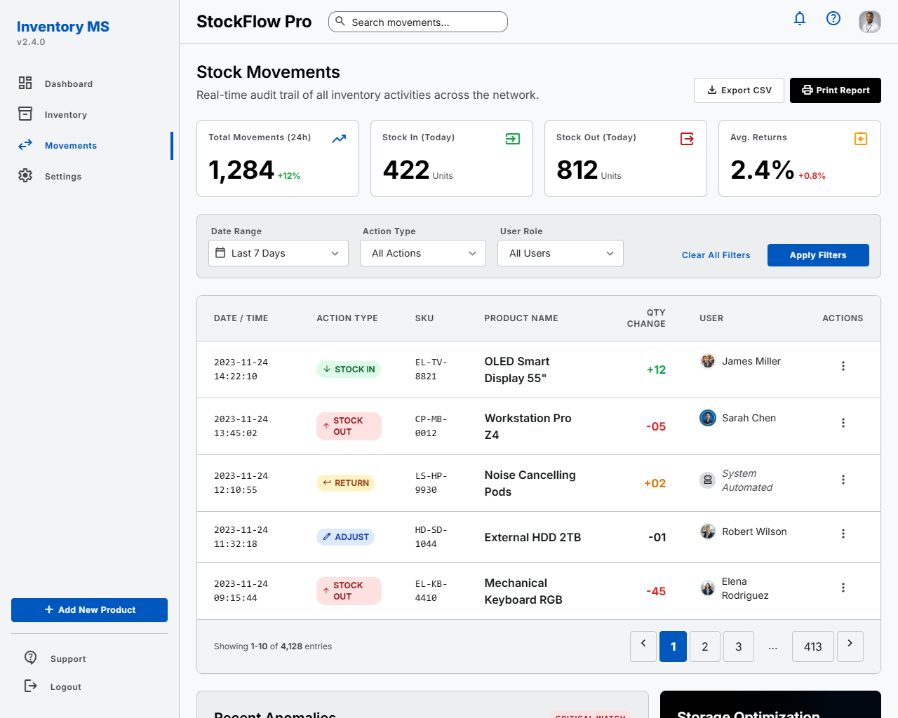
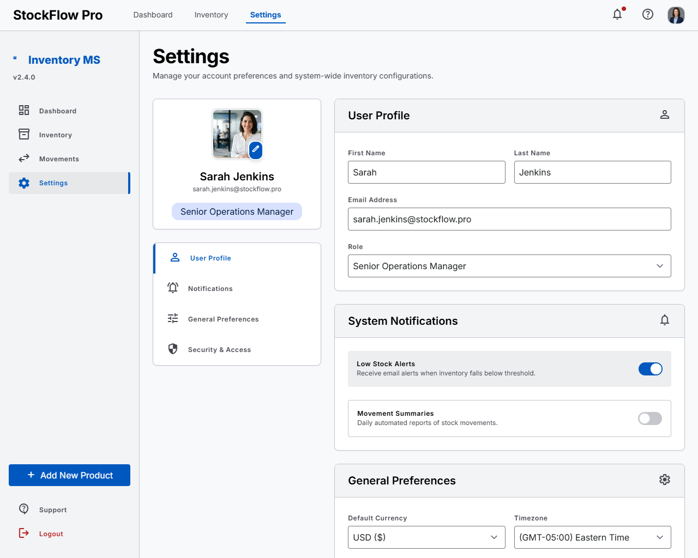
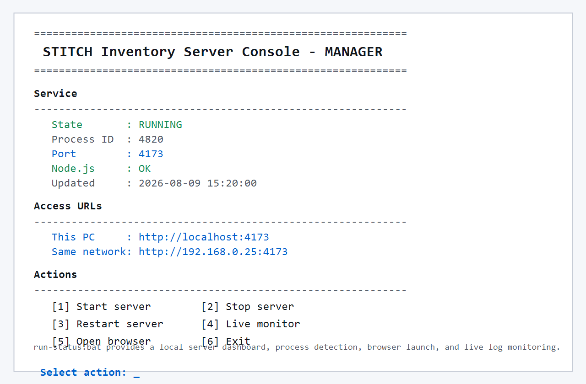

# STITCH Inventory Console

현장 실재고 조사와 입출고 이력 관리를 한 화면에서 처리하기 위한 재고 운영 시스템 포트폴리오입니다. 대시보드, 재고 목록, 재고 이동 이력, 환경 설정, 서버 실행 콘솔까지 포함한 Windows 기반 로컬 운영 도구입니다.

실제 운영 데이터와 계정 파일은 공개 저장소에 포함하지 않습니다. 아래 이미지는 포트폴리오용 화면 캡처입니다.



## 프로젝트 목적

재고 실사 업무는 전산재고, 현장 실사 수량, 입출고 이력, 부족 재고 확인이 분리되면 담당자가 계속 엑셀과 화면을 오가야 합니다. 이 프로젝트는 재고 담당자가 대시보드에서 전체 상태를 보고, 목록에서 품목을 확인하고, 이동 이력으로 변경 내역을 추적할 수 있도록 구성한 재고 운영 UI입니다.

핵심 목표는 다음과 같습니다.

- 전체 재고 현황과 부족 재고를 빠르게 파악
- SKU, 카테고리, 상태 기준으로 재고 목록 조회
- 입고, 출고, 반품, 조정 이력을 감사 로그처럼 확인
- 현장 실사 수량을 등급별로 관리
- Windows에서 서버 상태를 쉽게 확인하고 실행/중지

## 실제 화면

### 1. 운영 대시보드


전체 SKU 수, 부족 재고 경고, 월간 이동량, 창고 사용률을 한 화면에서 확인합니다. 최근 재고 이동과 카테고리별 재고 분포를 같이 보여주어 운영자가 우선 확인해야 할 재고 상태를 빠르게 볼 수 있습니다.

주요 기능:

- 전체 상품 수와 부족 재고 요약
- 월간 재고 이동량 표시
- 창고 보관 용량 상태 표시
- 최근 입출고 이력 요약
- 카테고리별 재고 비중 표시
- 리포트 내보내기 진입점

### 2. 재고 목록 관리



상품명, SKU, 카테고리, 재고 수준, 단가, 최근 갱신 시간을 표 형태로 관리합니다. 상태 배지를 통해 정상 재고, 부족 재고, 품절 품목을 빠르게 구분할 수 있습니다.

주요 기능:

- 상품명/SKU 기반 검색
- 카테고리 및 상태 필터
- 정상/부족/품절 상태 표시
- CSV 내보내기
- 신규 상품 추가 진입
- 품목별 액션 메뉴

### 3. 재고 이동 이력



입고, 출고, 반품, 조정 이력을 시간순으로 확인합니다. 수량 증감, 처리 사용자, SKU, 상품명을 함께 보여주어 재고 변경의 원인을 추적할 수 있습니다.

주요 기능:

- 최근 24시간 이동량 요약
- 입고/출고/반품/조정 유형 표시
- 날짜 범위, 액션 유형, 사용자 역할 필터
- CSV 내보내기와 인쇄 리포트
- 페이지네이션 기반 대량 이력 조회

### 4. 사용자 및 시스템 설정



운영자 프로필, 알림 설정, 기본 통화, 시간대 등 시스템 운영 설정을 관리하는 화면입니다.

주요 기능:

- 사용자 프로필 관리
- 부족 재고 알림 설정
- 재고 이동 요약 알림 설정
- 기본 통화와 시간대 설정
- 보안 및 접근 메뉴 구성

### 5. 서버 실행 콘솔



`run-status.bat`는 Windows에서 Node 서버를 쉽게 제어하기 위한 콘솔입니다. 서버 상태, 포트, Node.js 확인, 접속 URL을 보여주고 번호 선택으로 실행/중지/재시작/모니터링을 수행합니다.

주요 기능:

- 서버 실행, 중지, 재시작
- 현재 프로세스와 포트 확인
- 로컬 및 같은 네트워크 접속 URL 표시
- 브라우저 자동 열기
- 실시간 로그 모니터링

## 실행 방법

Node.js가 설치된 Windows 환경에서 루트의 실행 파일을 사용합니다.

```bat
run-status.bat
```

또는 앱 폴더에서 직접 실행할 수 있습니다.

```powershell
cd inventory_site
node server.js
```

기본 주소:

```text
http://localhost:4173
```

최초 실행 시 기본 계정은 `admin / 1234`입니다. 운영 환경에서는 환경변수로 계정을 바꿀 수 있습니다.

```powershell
$env:INVENTORY_USER="사용자ID"
$env:INVENTORY_PASSWORD="비밀번호"
node server.js
```

## 기술 스택

| 영역 | 사용 기술 |
| --- | --- |
| Frontend | HTML, CSS, JavaScript |
| Backend | Node.js HTTP server |
| Data | Local JSON file |
| Auth | PBKDF2 password hashing, session cookie |
| Import | Python Excel import helper |
| Platform | Windows Batch console |

## 데이터 보호

다음 운영 파일은 공개 저장소에서 제외합니다.

- `inventory_site/data.json`
- `inventory_site/users.json`
- `inventory_site/data.backup*.json`
- `inventory_site/server.log`
- `inventory_site/server-error.log`
- `.env`

공개 저장소에는 코드, 화면 캡처, 실행 스크립트, 포트폴리오 문서만 포함합니다.

## 저장소 구조

```text
stitch_/
├─ dashboard/                 # 대시보드 화면 캡처와 HTML
├─ inventory_list/            # 재고 목록 화면 캡처와 HTML
├─ stock_movements/           # 이동 이력 화면 캡처와 HTML
├─ settings/                  # 설정 화면 캡처와 HTML
├─ inventory_site/            # 실행 가능한 Node.js 재고 앱
├─ run-status.bat             # Windows 서버 콘솔
├─ run-status-screen.png      # 서버 콘솔 캡처
└─ README.md
```

## 포트폴리오 요약

이 프로젝트는 재고 관리 업무에서 필요한 현황 파악, 품목 조회, 이동 이력 추적, 운영 설정, 서버 실행 제어를 하나의 포트폴리오로 정리한 재고 운영 시스템입니다. 단순 정적 화면뿐 아니라 로컬 Node 서버, 로그인, JSON 저장, Excel 가져오기 도구, Windows 실행 콘솔까지 포함해 실제 운영 흐름을 고려했습니다.
