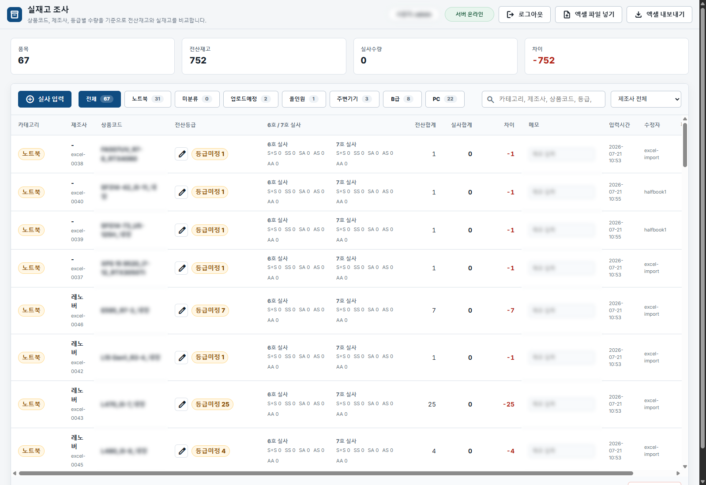
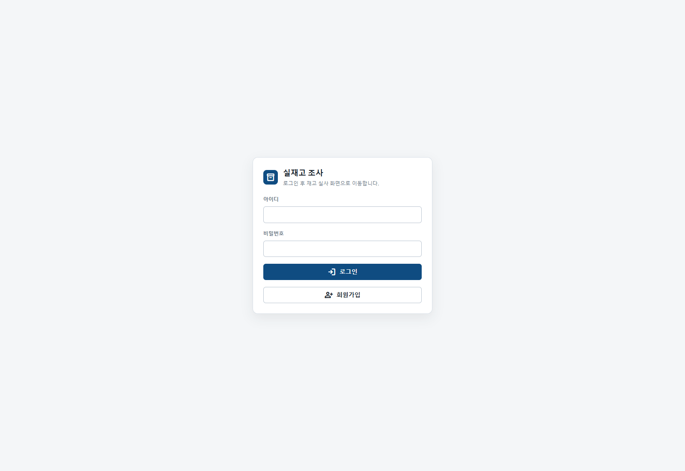
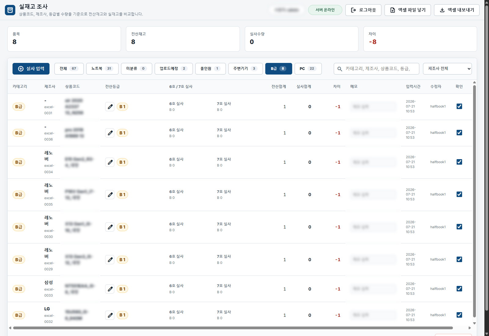
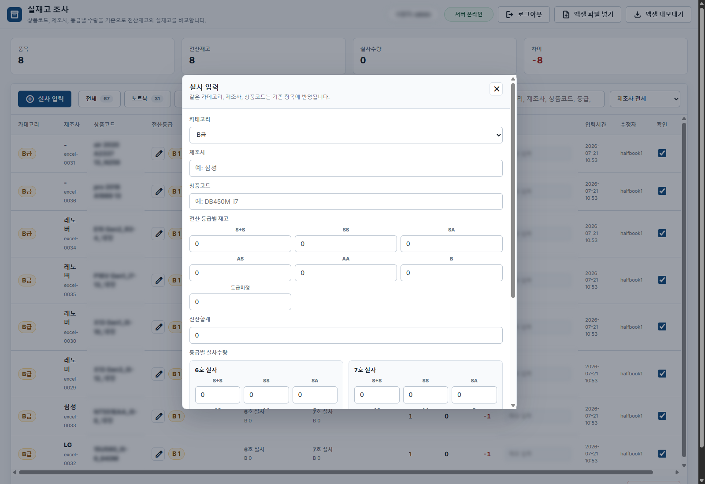

# STITCH Inventory Console

현장 실재고 조사와 입출고 이력 관리를 한 화면에서 처리하기 위한 재고 운영 시스템 포트폴리오입니다. 대시보드, 재고 목록, 재고 이동 이력, 환경 설정, 서버 실행 콘솔까지 포함한 Windows 기반 로컬 운영 도구입니다.

실제 운영 데이터 파일을 연결해 로컬 서버에서 실행한 화면을 캡처했습니다. 공개 저장소에 올리는 이미지라 상품코드, 메모, 사용자 정보 등 민감할 수 있는 영역은 마스킹했습니다.



## 프로젝트 목적

재고 실사 업무는 전산재고, 현장 실사 수량, 입출고 이력, 부족 재고 확인이 분리되면 담당자가 계속 엑셀과 화면을 오가야 합니다. 이 프로젝트는 재고 담당자가 대시보드에서 전체 상태를 보고, 목록에서 품목을 확인하고, 이동 이력으로 변경 내역을 추적할 수 있도록 구성한 재고 운영 UI입니다.

핵심 목표는 다음과 같습니다.

- 전체 재고 현황과 부족 재고를 빠르게 파악
- SKU, 카테고리, 상태 기준으로 재고 목록 조회
- 입고, 출고, 반품, 조정 이력을 감사 로그처럼 확인
- 현장 실사 수량을 등급별로 관리
- Windows에서 서버 상태를 쉽게 확인하고 실행/중지

## 실제 실행 화면

### 1. 로그인



실재고 조사 화면은 로그인 후 접근할 수 있습니다. 기본 계정 또는 운영 환경변수로 지정한 계정으로 접속하고, 필요 시 회원가입을 통해 사용자를 추가할 수 있습니다.

주요 기능:

- 로그인 기반 접근 제어
- 회원가입 화면 전환
- 세션 쿠키 기반 인증
- 로그인 실패 처리

### 2. 실재고 조사 메인 화면


실제 `inventory_site/data.json`을 읽어 렌더링한 운영 화면입니다. 품목 수, 전산재고, 실사수량, 차이를 요약하고, 상품별 전산등급과 6호/7호 실사 수량을 한 테이블에서 비교합니다.

주요 기능:

- 전체 품목, 전산재고, 실사수량, 차이 요약
- 카테고리별 필터
- 제조사 필터
- 카테고리, 제조사, 상품코드, 등급, 메모 검색
- 전산등급과 실사등급 수량 비교
- 차이 수량 자동 계산
- 확인 체크 및 수정자/입력시간 표시
- 엑셀 파일 가져오기
- 엑셀 내보내기

### 3. 카테고리 필터 화면



실제 운영 데이터에서 `B급`, `PC`, `노트북`, `업로드 예정` 같은 카테고리를 분리해 볼 수 있습니다. 필터를 선택하면 요약 지표와 테이블이 함께 갱신됩니다.

주요 기능:

- 카테고리별 품목 수 표시
- 선택 카테고리만 테이블에 표시
- B급 재고 별도 분리 관리
- 필터 상태에서 검색/제조사 필터 병행
- 카테고리별 차이 수량 확인

### 4. 실사 입력 모달



신규 실사 항목을 등록하거나 기존 항목을 수정하는 입력 화면입니다. 같은 카테고리, 제조사, 상품코드는 기존 항목에 반영되며, 등급별 전산재고와 6호/7호 실사 수량을 나눠 입력합니다.

주요 기능:

- 카테고리 선택
- 제조사와 상품코드 입력
- 전산 등급별 재고 입력
- 6호/7호 실사 수량 분리 입력
- 등급별 차이 계산
- 메모 저장
- 동일 품목 업데이트

### 5. 서버 실행 콘솔


`run-status.bat`는 Windows에서 Node 서버를 쉽게 제어하기 위한 콘솔입니다. 서버 상태, 포트, Node.js 확인, 접속 URL을 보여주고 번호 선택으로 실행/중지/재시작/모니터링을 수행합니다.

주요 기능:

- 서버 실행, 중지, 재시작
- 현재 프로세스와 포트 확인
- 로컬 및 같은 네트워크 접속 URL 표시
- 브라우저 자동 열기
- 실시간 로그 모니터링

## 실행 방법

Node.js가 설치된 Windows 환경에서 루트의 실행 파일을 사용합니다.

```bat
run-status.bat
```

또는 앱 폴더에서 직접 실행할 수 있습니다.

```powershell
cd inventory_site
node server.js
```

기본 주소:

```text
http://localhost:4173
```

최초 실행 시 기본 계정은 `admin / 1234`입니다. 운영 환경에서는 환경변수로 계정을 바꿀 수 있습니다.

```powershell
$env:INVENTORY_USER="사용자ID"
$env:INVENTORY_PASSWORD="비밀번호"
node server.js
```

## 기술 스택

| 영역 | 사용 기술 |
| --- | --- |
| Frontend | HTML, CSS, JavaScript |
| Backend | Node.js HTTP server |
| Data | Local JSON file |
| Auth | PBKDF2 password hashing, session cookie |
| Import | Python Excel import helper |
| Platform | Windows Batch console |

## 데이터 보호

다음 운영 파일은 공개 저장소에서 제외합니다.

- `inventory_site/data.json`
- `inventory_site/users.json`
- `inventory_site/data.backup*.json`
- `inventory_site/server.log`
- `inventory_site/server-error.log`
- `.env`

공개 저장소에는 코드, 화면 캡처, 실행 스크립트, 포트폴리오 문서만 포함합니다.

## 저장소 구조

```text
stitch_/
├─ dashboard/                 # 대시보드 화면 캡처와 HTML
├─ inventory_list/            # 재고 목록 화면 캡처와 HTML
├─ stock_movements/           # 이동 이력 화면 캡처와 HTML
├─ settings/                  # 설정 화면 캡처와 HTML
├─ docs/images/               # 실제 실행 화면 캡처
├─ inventory_site/            # 실행 가능한 Node.js 재고 앱
├─ run-status.bat             # Windows 서버 콘솔
└─ README.md
```

## 포트폴리오 요약

이 프로젝트는 재고 관리 업무에서 필요한 현황 파악, 품목 조회, 이동 이력 추적, 운영 설정, 서버 실행 제어를 하나의 포트폴리오로 정리한 재고 운영 시스템입니다. 단순 정적 화면뿐 아니라 로컬 Node 서버, 로그인, JSON 저장, Excel 가져오기 도구, Windows 실행 콘솔까지 포함해 실제 운영 흐름을 고려했습니다.
